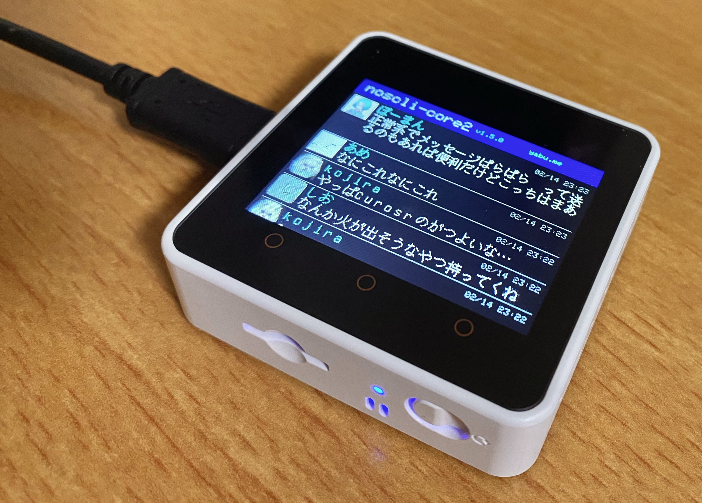

# noscli-core2



M5Stack Core2で動くNostrクライアント 🐾

## 機能

- Nostrリレー(WebSocket)に接続してタイムライン表示
- プロフィール画像の表示（JPEG / PNG / WebP / data:URI対応）
- 日本語表示（efontライブラリ）
- WiFi経由の書き込み

## 必要なもの

- M5Stack Core2
- PlatformIO
- WiFi環境

## セットアップ

### PlatformIOのインストール

```bash
pip install platformio
```

または [公式サイト](https://platformio.org/install) からVSCode拡張としてインストール。

### ビルド＆書き込み

```bash
git clone https://github.com/koteitan/noscli-core2.git
cd noscli-core2
cp secrets.h.example secrets.h  # WiFi認証情報・リレーを設定

# 書き込み (USB経由)
pio run -e m5stack-core2 -t upload

# 書き込み (WiFi経由)
pio run -e m5stack-core2 && curl -sF "firmware=@.pio/build/m5stack-core2/firmware.bin" http://<ESP32のIP>/update
```

## 設定 (secrets.h)

| 項目 | 定義 | 例 |
|---|---|---|
| WiFi SSID | `WIFI_SSID` | `"your_wifi_ssid"` |
| WiFi パスワード | `WIFI_PASS` | `"your_wifi_password"` |
| リレーホスト | `RELAY_HOST` | `"yabu.me"` |
| リレーポート | `RELAY_PORT` | `443` |
| リレーパス | `RELAY_PATH` | `"/"` |

## ライセンス

MIT

サードパーティライブラリのライセンスは [THIRD_PARTY_LICENSES.md](THIRD_PARTY_LICENSES.md) を参照。
